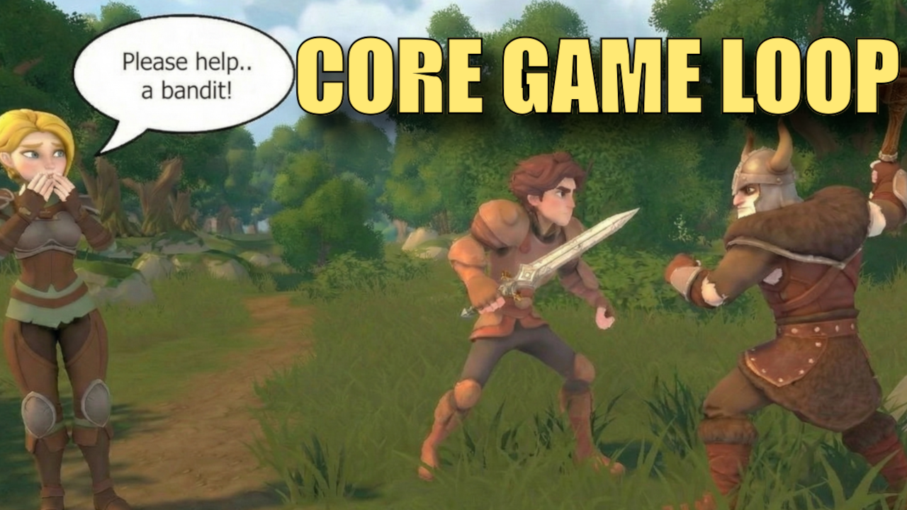

# Core Game Loop – Unity Project

This repository contains the **gameplay scripts and scene setup** for a simple but complete **core game loop** built in Unity.

The project demonstrates:
- A quest-giving NPC with dialogue and interaction
- Player combat against an enemy
- Looting an item and completing a quest
- A full end-to-end gameplay loop you can build on

This project accompanies a step-by-step walkthrough on YouTube where the full loop is built and explained.

👉 [*Core Game Loop*](https://youtu.be/EM15lvCiexY)

This repo is intended as a **learning and reference project**, created alongside a YouTube walkthrough.

---

## Unity Version

Built with **Unity 6.3 LTS (6000.3.x)** using URP.

⚠️ **Important:**  
Open the project using a matching Unity 6000.3.x editor to avoid upgrade prompts or unexpected changes.

---

## Third-Party Assets (Not Included)

To keep this repository lightweight and license-compliant, **third-party asset packages are not included** in git.

You’ll need to import the following assets locally before opening the project:

- `Assets/DoubleL/`
- `Assets/Fantasy Forest Environment/`
- `Assets/HeroCharacter/`  
  *(Hero Combat Controller package)*
- `Assets/Kevin Iglesias/`  
  *(Free animation packs from the Unity Asset Store)*

These assets should be imported **into the same folder paths listed above** so that references resolve correctly.

Links to all required assets are provided in the YouTube video description.

---

## Getting Started

1. Clone this repository.
2. Open Unity Hub and select **Unity 6000.3.x**.
3. Import the third-party assets listed above into the `Assets/` folder.
4. Open the project folder in Unity.
5. Allow Unity to regenerate solution files and complete the initial domain reload.
6. Open the main scene and press **Play**.

---

## Project Scope & Notes

- This project focuses on **system wiring and gameplay flow**, not polish or production-ready content.
- Code is intentionally kept straightforward and readable.
- Some systems (combat, UI, etc.) are expected to evolve in follow-up videos.
- Generated/build artifacts (`Library/`, `Temp/`, `Builds/`, etc.) are ignored — only source assets and scripts are tracked.

---

## License & Usage

All original code in this repository is free to use for learning and experimentation.

Third-party assets are subject to their **original licenses** and must be obtained separately via the Unity Asset Store or their respective authors.

---
